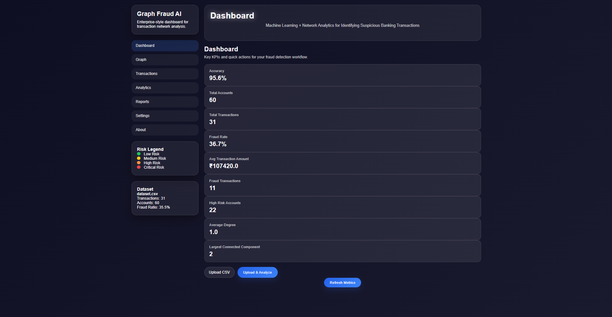
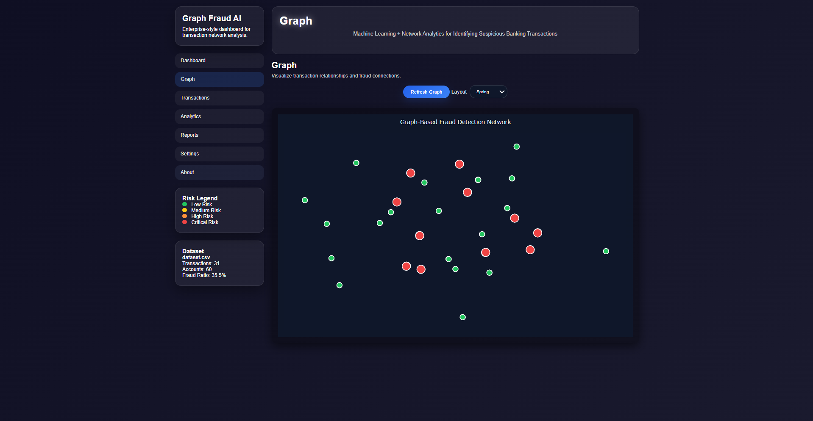
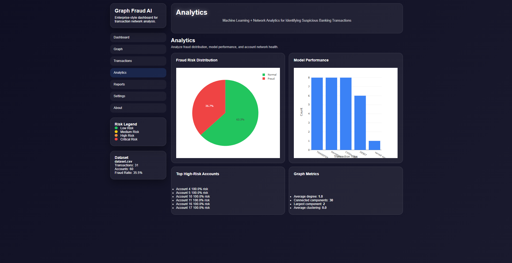
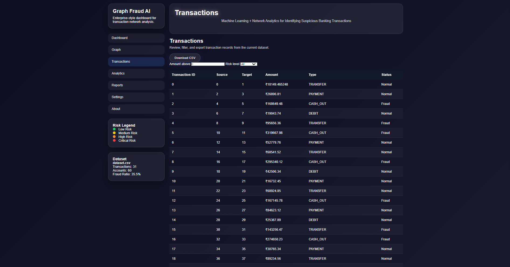
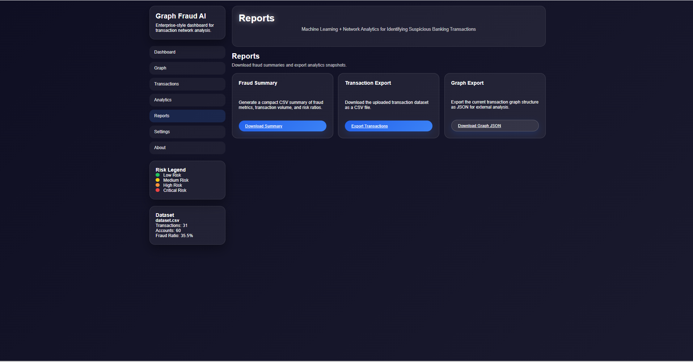
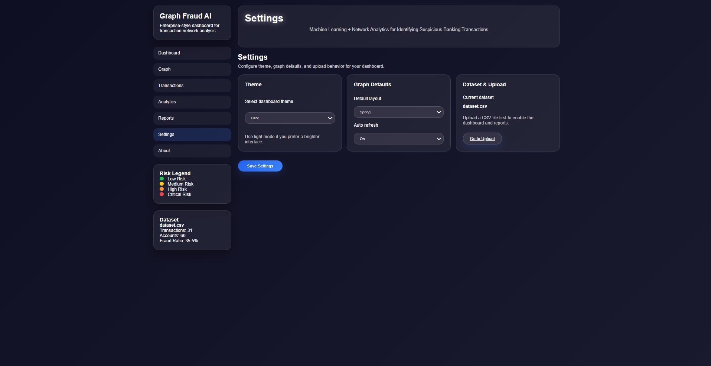
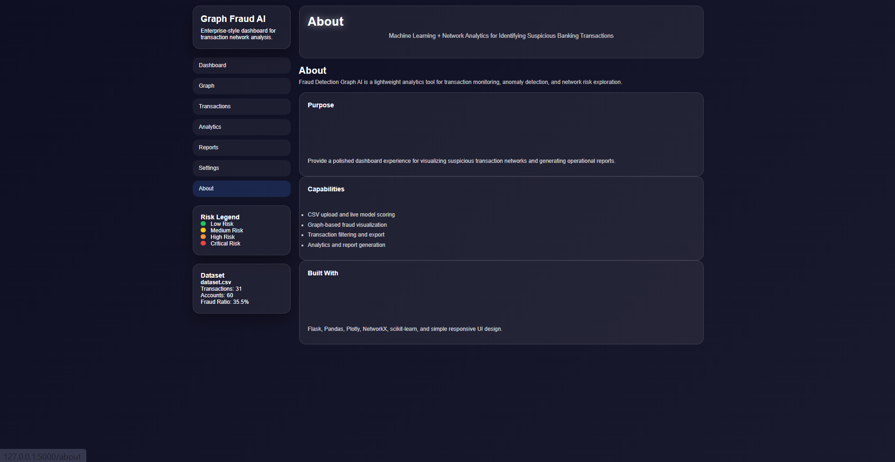

# Enterprise Graph-Based Fraud Detection Dashboard


A modern **Enterprise Fraud Detection Dashboard** that identifies suspicious banking transactions using **Machine Learning** and **Graph Analytics**.

The application models banking transactions as a graph where:

* Accounts → Nodes
* Transactions → Edges

It extracts graph-based features, predicts fraudulent accounts using a Random Forest classifier, and visualizes the network through an interactive Plotly dashboard.

---

# Dashboard Preview

## Dashboard



---

## Transaction Network



---

## Analytics



---

## Transactions



---

## Reports



---

## Settings



---

## About



---

# Project Overview

This project demonstrates how graph analytics can improve fraud detection by analyzing relationships between banking accounts instead of evaluating each transaction independently.

The dashboard provides:

* Fraud prediction
* Interactive graph visualization
* Network statistics
* Transaction explorer
* Fraud analytics
* Report generation
* Dataset upload
* Professional dashboard UI

---

# Features

## Machine Learning

* Random Forest Classifier
* Graph Feature Engineering
* Fraud Probability Prediction
* Account Risk Scoring

---

## Graph Analytics

* NetworkX Graph Construction
* Degree Calculation
* Average Transaction Amount
* Fraud Neighbor Detection
* Clustering Coefficient
* Connected Components
* Network Metrics

---

## Interactive Dashboard

* Modern Enterprise UI
* Responsive Layout
* Hover Tooltips
* Interactive Graph
* Dynamic Graph Refresh
* Fraud Metrics Dashboard
* Risk Legend

---

## Transaction Management

* CSV Upload
* Transaction Explorer
* Search Transactions
* Fraud Filtering
* Risk Categories

---

## Analytics

* Fraud Distribution
* Model Performance
* High Risk Accounts
* Network Statistics
* Graph Metrics

---

## Reports

* Summary Reports
* PDF Export
* CSV Export
* Graph Image Download

---

# Project Workflow

```text
CSV Banking Dataset
        │
        ▼
Data Cleaning
        │
        ▼
Graph Construction
(NetworkX)
        │
        ▼
Graph Feature Extraction
        │
        ▼
Random Forest Model
        │
        ▼
Fraud Prediction
        │
        ▼
Interactive Dashboard
```

---

# Technology Stack

### Backend

* Python
* Flask

### Machine Learning

* Scikit-learn
* Random Forest Classifier

### Graph Analytics

* NetworkX

### Data Processing

* Pandas
* NumPy

### Visualization

* Plotly

### Frontend

* HTML5
* CSS3
* JavaScript

---

# Dataset

The project uses a PaySim-inspired banking transaction dataset containing:

* Banking Accounts
* Transaction Types
* Transfer Amounts
* Fraud Labels
* Source Accounts
* Destination Accounts

Transaction Types include:

* TRANSFER
* PAYMENT
* CASH_OUT
* DEBIT

---

# Folder Structure

```
fraud-detection-graph-ai/

├── app.py
├── dataset.csv
├── Dockerfile
├── requirements.txt
├── README.md
├── pytest.ini

├── screenshot/

├── static/
│   ├── style.css
│   └── js/
│       ├── graph.js
│       └── main.js

├── templates/
│   ├── base.html
│   ├── dashboard.html
│   ├── graph.html
│   ├── analytics.html
│   ├── transactions.html
│   ├── reports.html
│   ├── settings.html
│   ├── about.html
│   └── index.html

├── tests/

└── uploads/
```

---

# Installation

Clone the repository

```bash
git clone https://github.com/vedangi-24/Fraud-detection-graph.git
```

Move into the project

```bash
cd Fraud-detection-graph
```

Install dependencies

```bash
pip install -r requirements.txt
```

Run the application

```bash
python app.py
```

Open

```
http://127.0.0.1:5000
```

---

# Testing

Run

```bash
pytest tests/ -v
```

---

# Docker

Build

```bash
docker build -t fraud-dashboard .
```

Run

```bash
docker run -p 5000:5000 fraud-dashboard
```

---

# API Endpoints

| Endpoint      | Description          |
| ------------- | -------------------- |
| /             | Dashboard            |
| /graph        | Graph Visualization  |
| /transactions | Transaction Explorer |
| /analytics    | Analytics Dashboard  |
| /reports      | Reports              |
| /settings     | Settings             |
| /about        | About                |
| /dynamic      | Refresh Graph        |
| /node/<id>    | Node Details         |

---

# Results

* Graph-based fraud visualization
* Fraud prediction using Machine Learning
* Interactive dashboard
* Network analysis
* Fraud risk scoring
* Real-time graph interaction
* CSV upload support
* Report generation
* Enterprise UI

---

# Future Improvements

* Graph Neural Networks (GNN)
* Neo4j Database Integration
* SHAP Explainability
* Community Detection
* Live Banking APIs
* Real-time Fraud Alerts
* User Authentication
* Multi-user Dashboard
* Cloud Deployment

---

# License

MIT License

---

# Author

**Vedangi Kulkarni**

GitHub:
https://github.com/vedangi-24

---

If you found this project useful, consider giving it a ⭐.
